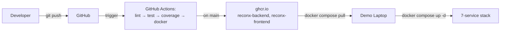

# ReconX — Enterprise Trade Reconciliation Platform

## Quick start (3 commands, < 60 s on a warm laptop)
\`\`\`bash
echo $GHCR_PAT | docker login ghcr.io -u <user> --password-stdin
docker compose pull
docker compose up -d
\`\`\`
Open http://localhost:5173 — login as `trader@db.com / trader123`.

## Table of contents
- [Architecture](#architecture) — mermaid runtime + CI/CD diagrams
- [Tech stack](#tech-stack) — Java 25, Spring Boot 3, Kafka, Postgres, React, Vite
- [API documentation](#api-documentation) — Swagger UI at /swagger-ui.html
- [Monitoring](#monitoring) — Prometheus scrape, Grafana dashboards (screenshots)
- [Kafka topics](#kafka-topics) — trade-events, recon-results, system-alerts, DLQ
- [Load test results](#load-test-results) — k6 200 VUs, p95 latency, throughput
- [CI/CD pipeline](#cicd-pipeline) — lint → test → coverage 85% → docker → GHCR
- [Deploy runbook](#deploy-runbook) — exactly 3 commands
- [Default credentials](#default-credentials) — dev profile only
- [Troubleshooting](#troubleshooting) — port conflicts, GHCR auth, Kafka listener
- [Team](#team) — who built what

## Runtime architecture

```mermaid
graph TD
    User[Ops Analyst] -->|HTTPS| FE[React + Vite<br/>nginx-alpine]
    FE -->|/api/* proxy| BE[Spring Boot 3<br/>Java 25]
    BE -->|JDBC| PG[(PostgreSQL 16<br/>+ Liquibase)]
    BE -->|KafkaTemplate| K[Apache Kafka<br/>trade-events, recon-results,<br/>system-alerts, DLQ]
    K -->|@KafkaListener| C1[ReconConsumer]
    K -->|@KafkaListener| C2[AuditConsumer]
    K -->|@KafkaListener| C3[AlertConsumer]
    C1 --> PG
    C2 --> PG
    BE -->|/actuator/prometheus| PR[Prometheus]
    PR --> GR[Grafana<br/>dashboards + alerts]
```

## CI/CD + deploy flow

